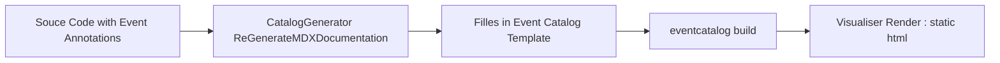


# EventDrivenArchitecture **Annotator**
This project is a code first [annotated] source mark up 

```csharp
namespace UserRegistration.Domain.Commands
{
    /// <summary>
    /// Command to register a new user.
    /// </summary>
    /// <remarks>
    /// In the context of Event Sourcing, commands are used to encapsulate all the information needed to perform an action or trigger a state change in the system.
    /// Commands are part of the Command Query Responsibility Segregation (CQRS) pattern, where they represent the "write" side of the application.
    /// 
    /// When a command is issued, it is handled by a command handler, which performs the necessary business logic and generates one or more events.
    /// These events are then persisted to an event store and used to update the state of the application.
    /// 
    /// The RegisterUserCommand class encapsulates the data required to register a new user, including the user's name, email, and password.
    /// When this command is handled, it will result in an event (e.g., UserRegisteredEvent) that represents the successful registration of the user.
    /// </remarks>
    [CommandMetadata(
        domain: "RegisterUser",
        name: "RegisterUser",
        description: "Command to register a new user.",
        version: "1.0",
        summary: "Registers a new user in the system.",
        owners: new[] { "admin@example.com" },
        address: "https://api.example.com/register",
        protocols: new[] { "HTTP", "HTTPS" },
        environments: new[] { "Production", "Staging" },
        channelOverview: "User registration channel"
    )]
    public class AddUserCommand
    {
        /// <summary>
        /// Gets or sets the user name.
        /// </summary>
        public string UserName
        {
            get; set;
        }
```

## Event Annotator: **Code-First Approach**

Intent : Documentation from one source of truth, the [annotated] code

The **Event Annotator** is a code-first tool that allows you to annotate source code in a way that automatically generates documentation, which is then rendered in the **Event Viewer**. 

This process enables seamless integration of event-driven architecture with clear, visual event documentation from [annotated] source code.

Different to model first focus on intergrating thirdparty event-driven components within your architecture, simplifying the process of managing complex integrations.

### Workflow 

Generate and save event MDX documentation 'catalog' from application C# source code [annotation], called 'bootstrapped' to be consumbed by 'eventcatalog build' command to bootstrap the catalog

Once your catalog is bootstrapped, the source will contain the EventCatalog scripts that you can invoke with your package manager
```
    //Compile your bootstrapped EDA catalog for Visualisation (Static Site) hosted anywhere 
    eventcatalog build
```             
**EventCatalog app** provides a set of scripts to help you generate, serve, and deploy your catalog



### Features:

- **Document Generation**: Automatically generate from [annotated] source code the Event Catalog schema catalog.
- **Event Catalog Schema**: The backbone of the system that defines events and their relationships.
- **Deploy**: With the Event Catalog Schema,  create the static Visualisation.
- **Open-Source Visualization**: Users can visualize event relationships and documentation through the open-source Event Viewer.

 EventCatalog helps you document your event-driven architectures in no time.

⚡ ️ Bring discoverability and governance to your event-driven architectures.

⚡️ Document your domains, services, messages (events, commands, queries) and channels.

⚡️ Supports documenting OpenAPI specifications, schemas, code examples and much more.

⚡️ EventCatalog visualizes your event-driven architectures.

Document our domains, services and messages
Version domains, services and messages
Visualize flow between messages in our system
Define bounded context and visualise our event-driven architecture?
Bring discoverability to event-driven architectures?

Event-driven architectures have been around for decades, and recently we have seen a rise of distributed message based architectures.

With companies providing high levels of abstractions and cloud based services, building event-driven/distributed architectures are becoming more accessible for developers every day.

These architecture styles are becoming popular as they provide teams the ability to create loosely coupled, distributed and highly scalable systems.

Practices like EventStorming and EventModeling are equally becoming popular within teams as they look to map their business and domains into software architecture.

### Complexity with event-driven architectures
When you start building event-driven architectures complexity may be hidden. Over time your architecture matures and grows, more producers/consumers, that's when complexity presents itself.

You may see questions start to emerge within your business:

- What messages (events, commands, queries) do we have?
- Why do these messages exist? What’s the context?
- What are the payloads of these messages?
- How can I make changes?
- Who is consuming these messages?


## Visualiser : Open-Source 
  A community-driven, open-source tool to visualize your event catalog in a user-friendly format.

  Transforms complex event flows into clear, interactive diagrams. 
  
  Gain insights at a glance and communicate effectively across teams.
  
  [Event Catalog - Viewer](https://demo.eventcatalog.dev/)


  https://www.kallemarjokorpi.fi/blog/how-to-create-and-event-catalog/

# **Model-First Approach** (Proprietary)

### Event Catalog: Visual Low-Code Model

Intent : Simplifying the process of managing complex integrations.

-  : **Event Studio** : Closed-Source Visual Editor
  A powerful, proprietary drag-and-drop editor designed for creating and managing your event catalog.

- **Generators for Third-Party Services**:
  Automatically generate scaffolding code for accessing external services through the Event Catalog schema, edited by the visual tools. For further details, refer to [Event Catalog Generator Documentation](https://www.eventcatalog.dev/docs/development/plugins/generators).

## **Overview**

The **Event Catalog Generators** leverage a schema defined in the visual editor and generate corresponding code. 

This code helps in seamless interaction with third-party services, simplifying the process of defining, managing, and integrating events within your application.

### Key Features:
- **Event Catalog Schema**: The backbone of the system that defines events and their relationships.
- **Code Generation**: Automatically generate scaffold code to interact with external services based on the Event Catalog schema.
- **Open-Source Visualization**: Users can visualize event relationships and documentation through the open-source Event Viewer.
- **Closed-Source Editor**: The proprietary editor allows for drag-and-drop event catalog creation, enabling easy and fast configuration of event-driven systems.

# Event Source Revenue Model ??

## **Event Source - Closed Source Visual Editor**

The **Event Source** is a drag-and-drop visual editor used to design your Event Catalog. It allows you to:
- **Drag and Drop (DnD) Widgets**: Add commercial provider widgets to the canvas, creating your event sources.
- **Code Generators**: Automatically generate scaffolding code to integrate with third-party services.

## **Event Source Workflow**

1. **Create Events**: Using the visual editor, you can drag and drop commercial provider widgets onto the canvas to create events and configure their parameters.
2. **Generate Code**: The generator tool scaffolds the necessary code to connect to and interact with the third-party services.
3. **Deploy**: With the generated code, deploy the event-driven components within your architecture, simplifying the process of managing complex integrations.

---
