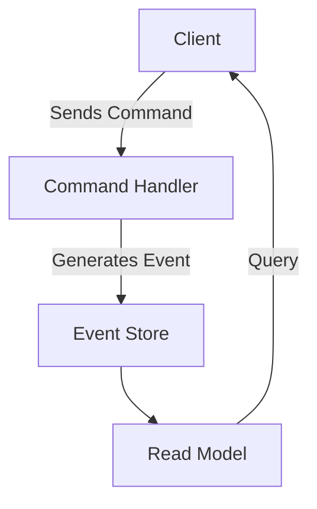

# Event Sourcing and CQRS
Event Sourcing, CQRS, and Event-Driven Architecture are powerful patterns for building scalable, resilient, and auditable systems. 

By capturing events as the source of truth and separating commands from queries, these patterns enable more flexibility, better system performance, and enhanced business insights.

## What is Event Sourcing?

Event Sourcing is a design pattern where the results of business operations are stored as a series of events. Each event represents a change in state and is immutable, meaning that once it is created, it cannot be altered. This pattern helps ensure that no business data is lost, as every operation results in an event being stored in the database.

### Key Benefits:
- **Auditing & Diagnostics**: All events are stored chronologically, enabling detailed auditing and diagnostics capabilities, both technical and business-related.
- **Business-Wide Reporting**: Since events contain business context, they allow for comprehensive analysis and reporting across the organization.
- **Immutable Event Log**: Business operations are recorded in a durable, append-only log, ensuring historical accuracy.

In contrast to state-oriented persistence models that store only the latest version of an entity, Event Sourcing captures every state change, making it possible to "replay" the events to reconstruct any past state of the system.

## Event Sourcing vs. Traditional State Storage

| Aspect                     | Event Sourcing   (Transactions-> Render Balance)      |  Traditional State Persistence  (CRUD - Atomic Value))      |
|----------------------------|-----------------------------------------------|---------------------------------------------|
| **Data Representation**     | Series of events (immutable)                  | Latest state (mutable)                      |
| **Data Loss**               | No data is lost, every operation is an event  | Risk of data loss if previous state is not stored |
| **Auditability**            | Built-in, as events are stored with timestamps | Not naturally supported      (CDC - Change Data Capture Complexity)                |
| **Reconstructing State**    | By replaying events in order                  | Not directly supported     Dont know how..                  |

**Eventual consistency** contrasts to traditional **ACID** (atomicity, consistency, isolation, durability).
If no new updates are made to a given data item, eventually all accesses to that item will return the last updated value.
Eventual consistency, also called optimistic replication, is widely deployed in distributed systems and has origins in early mobile computing projects.
A system that has achieved eventual consistency is often said to have converged, or achieved replica convergence

## Event Sourcing

Event Sourcing is an alternative to traditional state persistence. In a state-oriented system, the entity’s current state is stored, and the latest version replaces the old state. However, in Event Sourcing, each change in state (i.e., an event) is stored in an append-only log. This allows you to **reconstruct** the state of an entity at any point in time by replaying all the events associated with it.

### Example: Banking System

In a banking system, the transaction list (events like `DepositMade`, `WithdrawalMade`, etc.) is used to calculate the **aggregate balance**. These events are stored immutably, allowing a precise historical view of the account’s state.

---

## Terminology and Concepts
First, some terminology that we're going to use throughout this section:

**Event** - a persisted business event representing a change in state or record of an action taken in the system
**Stream** - a related "stream" of events representing a single aggregate
**Aggregate** - a type of projection that "aggregates" data from multiple events to create a single read-side view document
**Projection** - any strategy for generating "read side" views from the raw events
**Inline Projections** - a projection that executes "inline" as part of any event capture transaction to build read-side views that are persisted as a document
**Async Projections** - a projection that runs in a background process using an eventual consistency strategy, and is stored as a document
**Live Projections** - evaluates a projected view from the raw event data on demand within Marten without persisting the created view

Performance can be aggregating events via snapshot caching using the aggregate type.

### What is an Event?
An **Event** represents something that has already happened and is stored in the past tense. Events are not directed to a specific recipient—they are broadcasted and can be listened to by multiple consumers.

#### Example Event (JSON):
```json
{
  "id": "e44f813c-1a2f-4747-aed5-086805c6450e",
  "type": "invoice-issued",
  "streamId": "INV/2021/11/01",
  "streamPosition": 1,
  "timestamp": "2021-11-01T00:05:32.000Z",
  "data": {
    "issuedTo": {
      "name": "Oscar the Grouch",
      "address": "123 Sesame Street"
    },
    "amount": 34.12,
    "number": "INV/2021/11/01",
    "issuedAt": "2021-11-01T00:05:32.000Z"
  },
  "metadata": {
    "correlationId": "1fecc92e-3197-4191-b929-bd306e1110a4",
    "causationId": "c3cf07e8-9f2f-4c2d-a8e9-f8a612b4a7f1"
  }
}
```

### What is a Stream?
A **Stream** is a logical grouping of related events. Streams are typically tied to an entity or aggregate and allow the retrieval of that entity's state by replaying the events in sequence. Each event within a stream is assigned a unique **position**, often represented by an incremental integer.

### Event Representation
Events are typically represented in formats like **JSON**, **Binary**, or **XML**. Besides the data, events may also include metadata like **timestamp**, **correlation id**, and **causation id**.

---

## Event-Driven Architecture

Event-driven architecture is a system design paradigm that focuses on the communication between components using events. It provides many benefits, such as:

- **Asynchronous Processing**: Events can trigger actions across different services, leading to decoupling and scalability.
- **Fault Tolerance**: Since components are loosely coupled, failures in one component do not directly affect others.
- **Scalability**: Asynchronous nature allows components to scale independently based on demand.

Event Sourcing, when combined with **CQRS** (Command Query Responsibility Segregation), becomes even more powerful, allowing for the separation of **write** and **read** models, enhancing both performance and scalability.

---

## Command Query Responsibility Segregation (CQRS)

CQRS is a pattern where read and write operations are separated into distinct models. The write model is optimized for handling commands (actions that mutate state), while the read model is optimized for handling queries (actions that fetch state).

### How CQRS and Event Sourcing Work Together:
- **Commands** initiate state changes and produce events.
- **Events** are stored in an event store and can be used to update the read model.
- The **Read Model** is optimized for querying and may not reflect the latest state in real time, allowing for eventual consistency.

### CQRS Diagram



In this diagram:
- The **Client** sends a **Command** to the **Command Handler**, which generates an **Event**.
- The **Event** is stored in the **Event Store**, and the **Read Model** is updated accordingly.
- The **Client** can then query the **Read Model** for the most recent data.

---

## Task-Based UI

A **Task-Based UI** differs from a traditional CRUD-based UI by tracking the user’s actions as commands that represent their intentions. This type of UI is especially beneficial in CQRS systems, as it aligns with the separation of commands and queries.

In a task-based UI, the focus shifts from manipulating individual records (CRUD) to completing user tasks (commands), which may trigger one or more events.

---

## Domain-Driven Design (DDD)

In **Domain-Driven Design**, the **Application Service Layer** is responsible for executing domain logic and orchestrating tasks. Using a task-based UI in conjunction with CQRS ensures that the application aligns with the domain’s business logic, encapsulating behaviors and domain-specific operations.

---

## Eventual Consistency

In distributed systems using Event Sourcing and CQRS, achieving **Eventual Consistency** is often necessary. This means that the system may not be immediately consistent, but will eventually reach a consistent state once all events have been processed.

---

## Summary: RIDE Architecture

A simplified view of a CQRS system can be summarized using the **RIDE** pattern:

- **Read**: The client queries the system for data.
- **Intent**: The client expresses an intent to modify the data.
- **Domain**: The command is processed by the domain model.
- **Events**: Events are generated, stored, and consumed by the read model.

This can be visualized as:

```
Read => Intent => Domain => Events
```

---

## Getting Started with Event Sourcing in .NET

Here are some resources to get you started with Event Sourcing in .NET:
- [Event-Driven Architecture Tutorial](https://www.youtube.com/watch?v=n_o-xuuVtmw)
- [From Zero to Hero: Event-Driven Architecture](https://dometrain.com/course/from-zero-to-hero-event-driven-architecture/)
- [Implementing Event Sourcing with CQRS in .NET](https://mbarkt3sto.hashnode.dev/how-to-implement-event-sourcing-with-cqrs-using-ef-core-and-mediatr)

---

## Useful Links

- [Event Catalog Viewer Demo](https://demo.eventcatalog.dev/visualiser/domains/Orders/0.0.3)
- [Backstage.io Demos](https://backstage.io/demos)
- [EventCatalog in Backstage](https://www.eventcatalog.dev/docs/development/plugins/backstage/intro)


